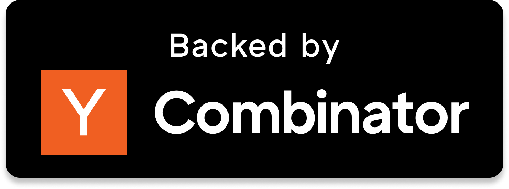

<div align="center">

# 


### Your browser, with AI superpowers 🚀
#### (Open Source Perplexity Comet Alternative)

[](https://discord.gg/YKwjt5vuKr)
[](https://twitter.com/browseros_ai)
[](LICENSE)
<a href="https://bit.ly/nxtscape">
  
</a>
<a href="https://bit.ly/browseros-windows">
  
</a>
<br />

<br />


</div>

🌐 zalk-os is an open-source agentic browser that runs AI agents locally. **Your privacy-first alternative to Perplexity Comet**.

🔒 Privacy first - use your own API keys or run local models with Ollama. Your data stays on your computer.

💡 Join our [Discord](https://discord.gg/YKwjt5vuKr) and help us build! Have feature requests? [Suggest anonymously here](https://dub.sh/nxtscape-feature-request).

## Quick start

1. Download and install zalk-os:
   - [macOS](https://bit.ly/nxtscape)
   - [Windows](https://cdn.browseros.com/win/zalk-os-installer.zip)
2. Import your Chrome data (optional)
3. Connect your AI provider (OpenAI, Anthropic, or local Ollama)
4. Start automating!

## What makes zalk-os special

<div align="center">

</div>

## Features

- 🏠 Feels like home - same familiar interface as Google Chrome, works with all your extensions
- 🤖 AI agents that run on YOUR browser, not in the cloud
- 🔒 Privacy first - bring your own keys or use local models with Ollama. Your browsing history stays on your computer
- 🚀 Open source and community driven - see exactly what's happening under the hood
- 🤝 (coming soon) MCP store to one-click install popular MCPs and use them directly in the browser bar
- 🛡️ (coming soon) Built-in AI ad blocker that works across more scenarios!  

## Demos

### 🤖 AI Agents in Action ([watch video](https://storage.googleapis.com/felafax-public/nxtscape/nxtscape-agent-demo.mp4))
<div align="center">

</div>

### 💬 Local AI Chat ([watch video](https://storage.googleapis.com/felafax-public/nxtscape/nxtscape-chat.mp4))
<div align="center">

</div>

### ⚡ Productivity Tools ([watch video](https://storage.googleapis.com/felafax-public/nxtscape/nxtscape-productivity.mp4))
<div align="center">

</div>

## Why we're building this

For the first time since Netscape in 1994, it feels like we can reimagine browsers from scratch. We saw how Cursor gave developers a 10x productivity boost, yet browsers feel stuck in the past.

You probably have 70+ tabs open right now. You're constantly fighting your browser instead of it helping you. Simple tasks like "order Tide Pods from my Amazon order history" should just work with AI agents. 

We believe AI agents should automate your work locally and securely, not send your data to some search or ad company.

## How we compare

<details>
<summary><b>vs Chrome</b></summary>
<br>
While we're grateful for Google open-sourcing Chromium, but Chrome hasn't evolved much in 10 years. No AI features, no automation, no MCP support.
</details>

<details>
<summary><b>vs Brave</b></summary>
<br>
We love what Brave started, but they've spread themselves too thin with crypto, search, VPNs. We're laser-focused on AI-powered browsing.
</details>

<details>
<summary><b>vs Arc/Dia</b></summary>
<br>
Many loved Arc, but it was closed source. When they abandoned users, there was no recourse. We're 100% open source - fork it anytime!
</details>

<details>
<summary><b>vs Perplexity Comet</b></summary>
<br>
They're a search/ad company. Your browser history becomes their product. We keep everything local.
</details>

## Building from Source

### Prerequisites

**macOS:**
- macOS 10.15 or later (tested on M4 Max)
- Xcode and Command Line Tools
- Python 3
- Git
- ~100GB of free disk space
- ~16GB RAM (recommended)

**Windows:**
- Windows 10 or later
- Visual Studio 2022 (with Windows SDK)
- Python 3
- Git
- ~100GB of free disk space
- ~16GB RAM (recommended)

### Build Instructions

#### Step 1: Clone zalk-os and Checkout Chromium

```bash
# Clone zalk-os repository
git clone https://github.com/browseros/browseros.git
cd browseros

# Create build directory and checkout Chromium
mkdir build
cd build

# Follow Chromium's official instructions:
# https://www.chromium.org/developers/how-tos/get-the-code/
# Make sure to checkout the exact version from CHROMIUM_VERSION file
```

#### Step 2: Build zalk-os

**macOS Debug Build:**
```bash
python build/build.py --config build/config/debug.yaml --chromium-src build
```

**macOS Release Build:**
```bash
python build/build.py --config build/config/release.yaml --chromium-src build
```

**Windows Debug Build:**
```bash
python build/build.py --config build/config/debug.yaml --chromium-src build
```

**Windows Release Build:**
```bash
python build/build.py --config build/config/release.yaml --chromium-src build
```

The build system will automatically:
1. Apply zalk-os patches to Chromium
2. Configure GN build flags
3. Compile the browser
4. Sign the app (macOS only)
5. Create the installer package

**Note:** First build takes ~3 hours on M4 Max. Subsequent builds are faster.

#### Step 3: Run zalk-os

**macOS:**
```bash
out/Default/Nxtscape.app/Contents/MacOS/Nxtscape --use-mock-keychain
```

**Windows:**
```bash
out\Default\browseros.exe
```

### Build Options

You can run individual build steps:

```bash
# Clean build artifacts
python build/build.py --clean

# Apply patches only
python build/build.py --apply-patches

# Build only (skip patching)
python build/build.py --build

# Package installer only
python build/build.py --package
```

### Troubleshooting

- **Build fails**: Ensure you have the exact Chromium version specified in `CHROMIUM_VERSION`
- **Out of memory**: Close other applications, consider using fewer parallel jobs
- **Patches fail**: Make sure your Chromium checkout is clean (`git status` should show no changes)

For detailed build documentation, see [docs/BUILD.md](docs/BUILD.md).

## Contributing

We'd love your help making zalk-os better!

- 🐛 [Report bugs](https://github.com/nxtscape/nxtscape/issues)
- 💡 [Suggest features](https://dub.sh/nxtscape-feature-request)
- 💬 [Join Discord](https://discord.gg/YKwjt5vuKr)
- 🐦 [Follow on Twitter](https://twitter.com/nxtscape)

## License

zalk-os is open source under the [AGPL-3.0 license](LICENSE).

---

<p align="center">
Built with ❤️ from San Francisco. Inspired by <a href="https://github.com/browser-use/browser-use">browser-use</a>, <a href="https://github.com/browserbase/stagehand">Stagehand</a>, <a href="https://github.com/nanobrowser/nanobrowser">Nanobrowser</a> and of course only possible because of <a href="https://github.com/chromium/chromium">Chromium</a>.
</p>
